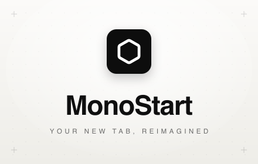

<div align="center">



# MonoStart

**Your browser's new tab, reimagined as a dashboard.**

A fast, fully customizable start page that replaces the empty new-tab page with a
drag-and-drop grid of links, search, and productivity widgets — privacy-first, with
no servers, no accounts, and no tracking.

[](https://developer.chrome.com/docs/extensions/mv3/intro/)
[](https://react.dev)
[](https://vite.dev)
[](https://www.typescriptlang.org)
[](LICENSE)

</div>

> [!NOTE]
> MonoStart is **source-available**, not open source. You're free to read, use, and
> modify the code for **noncommercial** purposes under the
> [PolyForm Noncommercial License 1.0.0](LICENSE). Commercial use requires written
> permission — see [License](#license).

---

## Table of contents

- [Features](#features)
- [User guide](#user-guide)
- [Privacy](#privacy)
- [Screenshots](#screenshots)
- [Install](#install)
- [Development](#development)
- [Project structure](#project-structure)
- [Permissions](#permissions)
- [Tech stack](#tech-stack)
- [Contributing](#contributing)
- [Security](#security)
- [License](#license)
- [Author](#author)

---

## Features

- 🧭 **Native Chrome feel** — keeps the familiar Google search bar, your history, and
  the instant new-tab you expect. Customization sits on top, never in your way.
- 🧩 **Drag-and-drop grid** — build the exact layout you want, then resize and arrange
  widgets to fit how you actually work.
- 🔍 **Built-in Google Search** — search Google or type a URL, with live autocomplete,
  history suggestions, 🎙️ voice search, and 📷 Google Lens image search.
- 🔗 **Link management** — group links into colored sections (folders) with adjustable
  columns, switch sections between grid and list view, and pin favorites to the header.
- ➕ **Save the current page** to your dashboard straight from the toolbar popup.
- 🌗 **Themes** — full light & dark support with customizable colors.

### Productivity widgets

| Widget | What it does |
| --- | --- |
| ✅ **Todos** | A quick checklist for the day |
| ⏱️ **Timers** | Run multiple labeled countdowns |
| 🔔 **Reminders** | One-time or recurring (hourly / daily / weekly / custom) browser notifications |
| 🗒️ **Sticky Notes** | Jot things down with custom colors |
| 🖼️ **Photo / Image** | Add an image from a URL or upload |
| 🔤 **Text Labels** | Add clean headers to style and section your grid |
| 🌐 **Embedded Pages** | Pin any website as a live widget |

## User guide

New to MonoStart? The **[User Guide](docs/USER_GUIDE.md)** is a complete, feature-by-feature
walkthrough — edit mode, links, groups, search, every widget, the toolbar popup, themes,
wallpapers, and a quick-reference table — written for end users.

## Privacy

MonoStart is built **privacy-first**:

- **No accounts, no servers, no analytics, no tracking, no ads.**
- Your layout, links, notes, and reminders are stored **locally on your device**
  (`chrome.storage.local`) — never synced to us, because we have no backend.
- The only data that leaves your browser is what you **type into the search box**
  (sent to Google for autocomplete, exactly like a normal search bar) and content
  you explicitly add (embedded pages / images load from their own source).

📄 Full policy: [`site/privacy-policy/index.html`](site/privacy-policy/index.html) — _hosted at: `https://<your-site>.netlify.app/privacy-policy/` (update once deployed)_

## Screenshots

<!-- Add real screenshots/GIFs of the dashboard here, e.g.:
<div align="center">
  
</div>
-->

_Coming soon._

## Install

### From the Chrome Web Store

_Pending review — link will be added once published._

### From source (unpacked)

```bash
# 1. Clone
git clone https://github.com/paurushrai/monostart-chrome-extension.git
cd monostart-chrome-extension

# 2. Install dependencies (Node 22+)
npm install

# 3. Build the extension → outputs to dist/
npm run build
```

### From source with Docker (no Node.js required)

The `Dockerfile` is a reproducible build pipeline — it runs the full quality gate
(typecheck + lint + tests) and exports the loadable extension. The extension itself
runs in Chrome, not in a container.

```bash
# 1. Clone
git clone https://github.com/paurushrai/monostart-chrome-extension.git
cd monostart-chrome-extension

# 2. Build the extension → outputs to dist/
docker build --target export --output type=local,dest=dist .
```

Re-run the same `docker build` command after pulling changes, then reload the
extension in `chrome://extensions`. To run only the quality gate (no output):

```bash
docker build --target builder .
```

### Load into Chrome

Whichever way you built `dist/`:

1. Open `chrome://extensions`
2. Enable **Developer mode** (top-right)
3. Click **Load unpacked** and select the **`dist/`** folder
4. Open a new tab 🎉

> [!TIP]
> After the first load, **reload the extension once** so the `favicon` permission
> takes effect — otherwise saved-link icons may not render.

## Development

Requires **Node.js 22+**.

```bash
npm run dev        # Vite dev server (UI preview, outside the extension host)
npm run watch      # Rebuild on change → reload the unpacked extension to see updates
npm run build      # Production build to dist/
npm run lint       # ESLint
npm run typecheck  # tsc --noEmit (strict)
npm test           # Vitest (run once)
npm run test:watch # Vitest (watch mode)
```

Before opening a PR, please ensure `npm run lint`, `npm run typecheck`, and `npm test`
all pass.

## Project structure

```text
monostart-chrome-extension/
├── public/                 # Static assets copied verbatim (manifest.json, icons, favicon)
├── src/
│   ├── components/         # UI components
│   │   ├── ui/             # shadcn/ui primitives (Radix + cva)
│   │   └── widgets/        # Dashboard widgets (search, todos, timers, reminders, …)
│   ├── hooks/              # React hooks (storage, dashboard state, …)
│   ├── lib/                # Pure logic — grid, favicon, theme, sanitizer
│   │   └── __tests__/      # Vitest unit tests
│   ├── popup/              # Toolbar popup ("save current page")
│   ├── background.js       # MV3 service worker (reminders, alarms, notifications)
│   └── types.ts            # Shared types
├── index.html              # New-tab dashboard entry
├── popup.html              # Toolbar popup entry
├── offscreen.html          # Offscreen document (reminder chime audio)
├── site/                   # Hosted privacy-policy page (Netlify)
└── vite.config.ts
```

## Permissions

MonoStart requests only what its single purpose — a customizable new-tab dashboard — requires:

| Permission | Why |
| --- | --- |
| `storage` / `unlimitedStorage` | Save layout, widgets, and preferences locally |
| `history` | Suggest recently visited sites in search (read on-device only) |
| `tabs` / `activeTab` | Save the current page from the popup; open the dashboard |
| `alarms` | Fire reminders on time, even with no tab open |
| `notifications` | Show a notification when a reminder is due |
| `offscreen` | Play a chime for due reminders (service workers can't play audio) |
| `favicon` | Display correct icons for saved shortcuts |
| `suggestqueries.google.com` (host) | Fetch Google search autocomplete |

## Tech stack

- **[React 19](https://react.dev)** + **[TypeScript](https://www.typescriptlang.org)** (strict)
- **[Vite 8](https://vite.dev)** — build & dev tooling
- **[Tailwind CSS](https://tailwindcss.com)** + **[shadcn/ui](https://ui.shadcn.com)** (Radix primitives, `class-variance-authority`)
- **[react-grid-layout](https://github.com/react-grid-layout/react-grid-layout)** — the drag-and-drop grid
- **[lucide-react](https://lucide.dev)** — icons
- **[date-fns](https://date-fns.org)** + **[react-day-picker](https://react-day-picker.js.org)** — reminder scheduling
- **[DOMPurify](https://github.com/cure53/DOMPurify)** — sanitizing embedded-page snippets
- **[Vitest](https://vitest.dev)** — unit testing
- **Manifest V3** Chrome extension (service worker, offscreen document)

## Contributing

Contributions for **noncommercial** improvements are welcome under the project's license.
See **[CONTRIBUTING.md](CONTRIBUTING.md)** for the full guide.

Quick version:

1. Fork and create a feature branch (`feat/your-thing`).
2. Keep commits in [Conventional Commits](https://www.conventionalcommits.org) style (`type(scope): summary`).
3. Run `npm run lint && npm run typecheck && npm test` — all must pass.
4. Open a PR describing **what**, **why**, and **how to test**.

Bug reports and feature ideas are welcome via [GitHub Issues](https://github.com/paurushrai/monostart-chrome-extension/issues).

## Security

Found a vulnerability? Please report it **privately** to **[paurushrai96@gmail.com](mailto:paurushrai96@gmail.com)** rather
than opening a public issue. You'll get a response as soon as possible.

## License

MonoStart is **source-available** under the **[PolyForm Noncommercial License 1.0.0](LICENSE)**.

- ✅ Use, copy, modify, and redistribute for **noncommercial** purposes.
- ❌ Commercial use (selling, paid hosting, bundling in commercial products, or any
  revenue-generating use) is prohibited without prior written permission.

For commercial licensing inquiries: **[paurushrai96@gmail.com](mailto:paurushrai96@gmail.com)**.

Copyright © 2026 Paurush Rai. All rights reserved.

## Author

Built by **[Paurush Rai](https://www.paurushrai.in)**.
